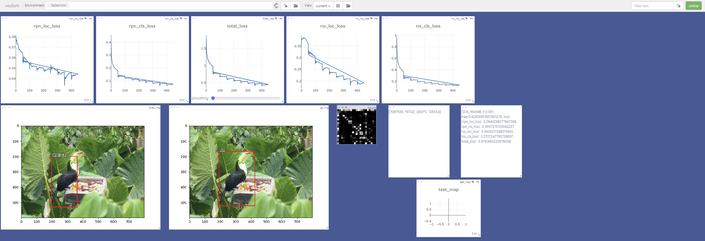
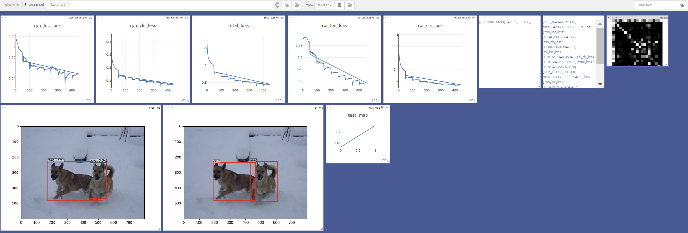

# Faster R-CNN Implementation

### 📝 논문 리뷰: [Faster R-CNN Paper Review](https://velog.io/@davidlyoo/Faster-R-CNN-Paper-Review-An-End-to-End-Solution-for-Efficient-Object-Detection)

## 📌 프로젝트 개요
이 프로젝트는 **Faster R-CNN**을 사용하여 **PASCAL VOC2007** 데이터셋에서 객체 탐지(Object Detection)를 수행하는 구현입니다. 

Faster R-CNN은 CNN 기반의 대표적인 객체 탐지 알고리즘으로, **Region Proposal Network(RPN)**을 활용하여 효율적인 **Region of Interest(RoI)**를 찾고, 이를 기반으로 객체를 분류하고 위치를 예측합니다.

본 프로젝트는 **Backbone Network**로 **VGG16**을 사용하며, **Caffe 등의 추가 라이브러리 없이 간단하게 PyTorch에서 구현**하도록 설계되었습니다.

---
## 1️⃣ 🛠 설치 및 환경 구성
###  환경 설정
```bash
# Conda 환경 생성
conda create --name faster_rcnn python=3.7
conda activate faster_rcnn

# PyTorch 설치
conda install pytorch torchvision cudatoolkit=10.2 -c pytorch

# 의존성 패키지 설치
pip install -r requirements.txt

# Visdom 실행 (시각화)
nohup python -m visdom.server &
```

---
## 2️⃣ 📂 데이터 준비
### PASCAL VOC2007 데이터셋 다운로드
```bash
wget http://host.robots.ox.ac.uk/pascal/VOC/voc2007/VOCtrainval_06-Nov-2007.tar
wget http://host.robots.ox.ac.uk/pascal/VOC/voc2007/VOCtest_06-Nov-2007.tar
wget http://host.robots.ox.ac.uk/pascal/VOC/voc2007/VOCdevkit_08-Jun-2007.tar
```
### 데이터 압축 해제
```bash
tar xvf VOCtrainval_06-Nov-2007.tar
tar xvf VOCtest_06-Nov-2007.tar
tar xvf VOCdevkit_08-Jun-2007.tar
```
### 데이터 폴더 경로 설정
`utils/config.py` 파일에서 `voc_data_dir` 경로를 설정하세요.
```python
class Config:
    voc_data_dir = '/dataset/PASCAL2007/VOC2007'
```
> 💡 기본 경로를 유지하려면 심볼릭 링크를 사용할 수도 있습니다.
```bash
ln -s /path/to/your/VOC2007 /dataset/PASCAL2007/VOC2007
```

---
## 3️⃣ 🚀 모델 학습
### 학습 시작
```bash
python train.py train --env='fasterrcnn' --plot-every=100
```

### 주요 학습 옵션
| 옵션           | 설명                                      | 기본값 |
|---------------|---------------------------------------|-------|
| `--plot-every` | 매 `n`번째 배치마다 예측 및 손실 시각화 수행  | `100` |
| `--env`       | Visdom 시각화 환경 이름 설정              | `'fasterrcnn'` |
| `--voc_data_dir` | PASCAL VOC 데이터셋이 저장된 디렉토리 지정 | `'/dataset/PASCAL2007/VOC2007'` |
| `--use-drop`  | RoI Head에서 Dropout 사용 여부          | `False` |
| `--use-Adam`  | 기본 옵티마이저(SGD) 대신 Adam 사용      | `False` |
| `--load-path` | 사전 학습된 모델 경로 지정               | `None` |

### 학습 과정 시각화
```bash
python -m visdom.server
```
웹 브라우저에서 [http://localhost:8097](http://localhost:8097)에 접속하여 학습 과정을 실시간으로 모니터링하세요.
| training_detection_1.png | training_detection_2.png|
|--------------|--------------|
|  |  |

---
## 📂 프로젝트 폴더 구조
```plaintext
├── dataset/                # 데이터셋 관련 코드
│   ├── voc_dataset.py      # PASCAL VOC 데이터 로더
│   ├── dataset.py          # 학습 및 테스트용 데이터셋 클래스
│   ├── util.py             # 바운딩 박스 변환 및 이미지 처리 함수
│   ├── __init__.py
├── model/                  # Faster R-CNN 및 VGG-16 모델 정의
│   ├── faster_rcnn.py      # Faster R-CNN 기본 클래스
│   ├── faster_rcnn_vgg16.py # VGG-16을 기반으로 한 Faster R-CNN 모델
│   ├── region_proposal_network.py # RPN 정의
│   ├── __init__.py
├── utils/                  # 보조 함수 및 설정 파일
│   ├── config.py           # 설정값 (데이터 경로, 하이퍼파라미터 등)
│   ├── array_tool.py       # 텐서 변환 유틸리티 함수
│   ├── eval_tool.py        # 성능 평가 관련 함수
│   ├── vis_tool.py         # 학습 과정 시각화
│   ├── __init__.py
├── images/                 # 훈련 시각화 이미지
│   ├── 1.png
│   ├── 2.png
│   ├── 3.png
│   ├── 4.png
├── train.py                # 모델 학습 스크립트
├── trainer.py              # 학습 로직을 구현하는 클래스 (FasterRCNNTrainer)
├── requirements.txt        # Python 패키지 목록
├── README.md               # 프로젝트 문서
```

---

## 📢 출처

이 프로젝트는 [simple-faster-rcnn-pytorch](https://github.com/chenyuntc/simple-faster-rcnn-pytorch/tree/master) 저장소의 코드를 기반으로 개선 및 수정되었습니다. 원본 프로젝트의 저자들께 깊은 감사를 드립니다.

## 📍 참고 자료
- [Faster R-CNN 논문](https://arxiv.org/abs/1506.01497)
- [PASCAL VOC 데이터셋](http://host.robots.ox.ac.uk/pascal/VOC/)
- [Visdom](https://github.com/facebookresearch/visdom)

---
## ✅ 마무리
이 프로젝트는 **PASCAL VOC2007** 데이터셋을 기반으로 **Faster R-CNN**을 학습하는 데 초점을 맞추고 있습니다. 필요에 따라 코드 및 설정을 수정하여 다른 데이터셋에도 적용할 수 있습니다. 🚀
